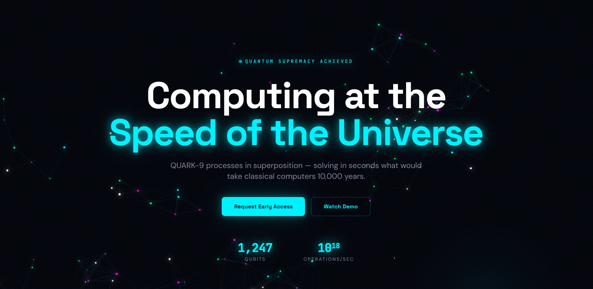

<div align="center">

<br/>

# ⚛️ QUARK — Quantum Computing Landing Page

### *Computing at the Speed of the Universe*

[](https://react.dev/)
[](https://www.typescriptlang.org/)
[](https://vitejs.dev/)
[](https://tailwindcss.com/)
[](https://www.framer.com/motion/)

<br/>

> **QUARK-9** processes in superposition — solving in seconds what would take classical computers **10,000 years**.  
> A stunning, animated quantum computing promotional landing page built with React, TypeScript, and cutting-edge web technologies.

<br/>



<br/>

</div>

---

## 📋 Table of Contents

- [✨ Features](#-features)
- [🏗️ Project Structure](#️-project-structure)
- [🧩 Sections Overview](#-sections-overview)
- [🛠️ Tech Stack](#️-tech-stack)
- [🚀 Getting Started](#-getting-started)
- [📦 Available Scripts](#-available-scripts)
- [🎨 Design System](#-design-system)
- [🧪 Testing](#-testing)
- [📁 File Reference](#-file-reference)

---

## ✨ Features

- 🌌 **Animated Particle Canvas** — an interactive WebGL-powered starfield/quantum-network background that responds dynamically as you scroll
- 🦾 **Framer Motion Animations** — smooth entrance animations, staggered reveals, and hover micro-interactions throughout every section
- 📊 **Live Performance Benchmarks** — animated counters and charts showcasing QUARK-9's quantum advantage over classical hardware
- 🔮 **Qubit Visualizer** — an interactive visual representation of qubit superposition states
- 🧠 **Use Cases Section** — highlights real-world applications across drug discovery, cryptography, financial modelling, climate simulation, and AI optimization
- 📰 **Investors & PR Section** — social proof from top-tier investors and press coverage
- 📬 **Early Access CTA** — conversion-focused section with an email capture form
- 📱 **Fully Responsive** — pixel-perfect layout across mobile, tablet, and desktop
- ⚡ **Blazing Fast** — built with Vite for near-instant HMR and optimized production builds
- 🎨 **Dark Neon Aesthetic** — deep space dark mode with vibrant cyan (`#00FFFF`) accent colors and glowing UI elements

---

## 🏗️ Project Structure

```
neon-quantum-pulse/
├── public/                    # Static public assets
├── screenshot/
│   └── image.png              # Landing page preview screenshot
├── src/
│   ├── components/
│   │   ├── ui/                # Shadcn/ui base component library
│   │   ├── ParticleCanvas.tsx # Animated starfield background
│   │   ├── HeroSection.tsx    # Hero section with headline & CTA
│   │   ├── WhatWeBuiltSection.tsx   # Product feature highlights
│   │   ├── UseCasesSection.tsx      # Industry use cases
│   │   ├── QubitVisualizer.tsx      # Interactive qubit visual
│   │   ├── PerformanceBenchmark.tsx # Benchmark metrics & charts
│   │   ├── InvestorsSection.tsx     # Investor logos & press
│   │   ├── EarlyAccessSection.tsx   # Email capture / CTA
│   │   ├── FooterSection.tsx        # Footer with links
│   │   └── NavLink.tsx              # Navigation link component
│   ├── hooks/                 # Custom React hooks
│   ├── lib/                   # Utility functions (cn, etc.)
│   ├── pages/
│   │   ├── Index.tsx          # Main page — assembles all sections
│   │   └── NotFound.tsx       # 404 error page
│   ├── App.tsx                # Root component & router setup
│   ├── main.tsx               # Application entry point
│   └── index.css              # Global styles & Tailwind directives
├── index.html                 # HTML shell
├── tailwind.config.ts         # Tailwind theme configuration
├── vite.config.ts             # Vite build configuration
├── tsconfig.json              # TypeScript configuration
└── package.json               # Dependencies & scripts
```

---

## 🧩 Sections Overview

| # | Section | Description |
|---|---------|-------------|
| 1 | **🌌 ParticleCanvas** | Full-screen animated particle network — simulates quantum entanglement visually |
| 2 | **🚀 HeroSection** | Bold headline, subheading, stat counters (1,247 Qubits · 10¹⁸ ops/sec), and CTA buttons |
| 3 | **🔧 WhatWeBuiltSection** | Three-column feature grid: Quantum Processor, Error Correction, Cloud Access |
| 4 | **💡 UseCasesSection** | Cards for drug discovery, cryptography, finance, climate modeling, and AI |
| 5 | **🔮 QubitVisualizer** | Animated diagram illustrating qubit superposition and entanglement |
| 6 | **📊 PerformanceBenchmark** | Side-by-side comparison of QUARK-9 vs classical computers with animated bars |
| 7 | **💼 InvestorsSection** | Trusted-by logos and press mentions for social proof |
| 8 | **📬 EarlyAccessSection** | Email sign-up form with a glowing CTA to join the waiting list |
| 9 | **📎 FooterSection** | Navigation links, social icons, and copyright |

---

## 🛠️ Tech Stack

| Technology | Version | Purpose |
|------------|---------|---------|
| [React](https://react.dev/) | 18.3 | UI component framework |
| [TypeScript](https://www.typescriptlang.org/) | 5.8 | Type-safe JavaScript |
| [Vite](https://vitejs.dev/) | 5.4 | Lightning-fast dev server & bundler |
| [Tailwind CSS](https://tailwindcss.com/) | 3.4 | Utility-first styling |
| [Framer Motion](https://www.framer.com/motion/) | 12 | Declarative animations |
| [Shadcn/ui](https://ui.shadcn.com/) | latest | Headless UI component primitives |
| [Radix UI](https://www.radix-ui.com/) | latest | Accessible component foundations |
| [React Router DOM](https://reactrouter.com/) | 6.30 | Client-side routing |
| [TanStack Query](https://tanstack.com/query) | 5.83 | Server-state management |
| [Lucide React](https://lucide.dev/) | 0.462 | Icon library |
| [Recharts](https://recharts.org/) | 2.15 | Data visualization / charts |
| [React Hook Form](https://react-hook-form.com/) | 7.61 | Form state management |
| [Zod](https://zod.dev/) | 3.25 | Schema validation |
| [Sonner](https://sonner.emilkowal.ski/) | 1.7 | Toast notifications |
| [Vitest](https://vitest.dev/) | 3.2 | Unit testing framework |
| [Playwright](https://playwright.dev/) | 1.57 | End-to-end testing |

---

## 🚀 Getting Started

### Prerequisites

Make sure you have one of the following installed:

- **Node.js** `>= 18.x` — [Download](https://nodejs.org/)
- **npm** `>= 9.x` (comes with Node.js) or **bun** / **pnpm**

### Installation

```bash
# 1. Clone the repository
git clone https://github.com/kuruminyx/QUARK-Quantum-Computing-Landing-Page.git
cd QUARK-Quantum-Computing-Landing-Page

# 2. Install dependencies
npm install

# 3. Start the development server
npm run dev
```

The app will be available at **[http://localhost:8080](http://localhost:8080)** (or the next available port).

> **Tip:** The dev server supports Hot Module Replacement (HMR) — changes are reflected instantly without a full page reload.

---

## 📦 Available Scripts

| Command | Description |
|---------|-------------|
| `npm run dev` | Start the Vite development server with HMR |
| `npm run build` | Build optimized production bundle to `dist/` |
| `npm run build:dev` | Build in development mode (with source maps) |
| `npm run preview` | Locally preview the production build |
| `npm run lint` | Run ESLint across all source files |
| `npm run test` | Run all Vitest unit tests once |
| `npm run test:watch` | Run Vitest in interactive watch mode |

---

## 🎨 Design System

The UI follows a **dark neon quantum** aesthetic:

- **Background:** Deep space black `#020817`
- **Primary Accent:** Electric cyan `#00FFFF` / `#06B6D4`
- **Secondary Accent:** Neon magenta `#FF00FF`
- **Glow Effects:** CSS `box-shadow` and `text-shadow` with cyan at varying opacity
- **Typography:** System font stack / Inter — clean, modern sans-serif
- **Motion:** Framer Motion with easing curves for cinematic entrance animations
- **Layout:** Full-viewport sections with centered content and generous spacing

Custom Tailwind extensions are configured in `tailwind.config.ts` to support the neon glow color palette and animation utilities.

---

## 🧪 Testing

### Unit Tests (Vitest)

```bash
npm run test
```

Tests are located in `src/test/` and cover component logic and utility functions.

### End-to-End Tests (Playwright)

```bash
npx playwright test
```

Playwright configuration is in `playwright.config.ts`. E2E tests verify navigation, form interactions, and section visibility.

---

## 📁 File Reference

| File | Purpose |
|------|---------|
| `src/components/ParticleCanvas.tsx` | Canvas-based animated particle quantum network |
| `src/components/HeroSection.tsx` | Main hero with animated headline and stat counters |
| `src/components/WhatWeBuiltSection.tsx` | Feature highlight cards |
| `src/components/UseCasesSection.tsx` | Industry application cards |
| `src/components/QubitVisualizer.tsx` | Interactive qubit state visualizer |
| `src/components/PerformanceBenchmark.tsx` | Animated benchmark comparison chart |
| `src/components/InvestorsSection.tsx` | Investors and press logos |
| `src/components/EarlyAccessSection.tsx` | Email waitlist sign-up CTA |
| `src/components/FooterSection.tsx` | Site footer |
| `tailwind.config.ts` | Custom Tailwind theme tokens and plugins |
| `vite.config.ts` | Vite plugins, aliases (`@/`), and server config |

---

<div align="center">

<br/>

**Built with ⚛️ and a passion for the quantum frontier.**

*QUARK — Where classical limits end, quantum begins.*

<br/>

</div>
